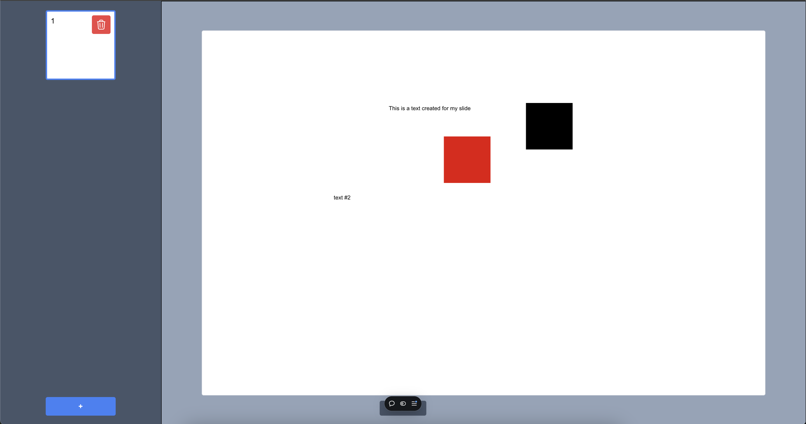

This is a [Next.js](https://nextjs.org) project bootstrapped with [`create-next-app`](https://github.com/vercel/next.js/tree/canary/packages/create-next-app).

## Getting Started

Live Site: https://itranslides.vercel.app/

YouTube Video: https://youtu.be/TR4XERMdOuY

Websocket Server Repository: https://github.com/DavidJoao/itranslides-websocket

## Tools and Technologies

## Tools and Technologies

  
  
  
  
  
  
  

- Javascript (Node, Next.js)
- Trello
- Postman
- Socket.io
- MongoDB
- TailwindCSS

## User Stories

- As a user, I want to enter the application with an arbitrary nickname without registration or authentication so that I can immediately start using the software.
- As a user, I want to see a list of available presentations upon entry so that I can choose to join an existing one.
- As a user, I want to create a new presentation so that I can start collaborative work with others.
- As a presentation creator, I want to see a list of connected users on the right panel so that I can manage user roles.
- As a presentation creator, I want to assign other users as "Editors" or switch them back to "Viewers" so that I can control editing permissions.
- As a viewer, I want to see the collaborative work without having access to editing tools so that I can observe the presentation.
- As an editor, I want to edit the content of the slides collaboratively with others so that we can work together in real time.
- As a presentation creator, I want to add or remove slides so that I can structure the presentation as needed.
- As a user, I want all edits to appear immediately for everyone so that the collaboration feels seamless and real-time.
- As a user, I want to see all previous edits stored forever so that I can review or continue work from where it was left off.
- As a user, I want the slide area to fill the whole window, scaling or scrolling appropriately so that I can focus on the content.
- As an editor, I want to add editable and movable text blocks with Markdown formatting so that I can format text effectively.
- As a user, I want to enter a "Present" mode so that I can showcase the slides to others.

### Optional Features:
- As an editor, I want to erase previously drawn elements so that I can correct mistakes or remove unwanted content.
- As an editor, I want to add multiple additional shapes like rectangles, circles, and arrows with color options so that I can create visual elements.
- As an editor, I want to upload and use images in slides so that I can make the presentation more engaging.
- As a user, I want to zoom in and out of slides so that I can focus on specific details or see the full context.
- As a user, I want to see a preview thumbnail image of the first slide in the presentation list so that I can quickly identify presentations.
- As a user, I want animations and transitions between slides so that the presentation feels dynamic and professional.
- As a user, I want to export the presentation to PDF so that I can share it with others offline.

## Screenshots

## Still In Development Features
- Real time updates in dashboard creating or deleting presentations
- Eraser for presentations
- Assigning different roles for viewers/editors

